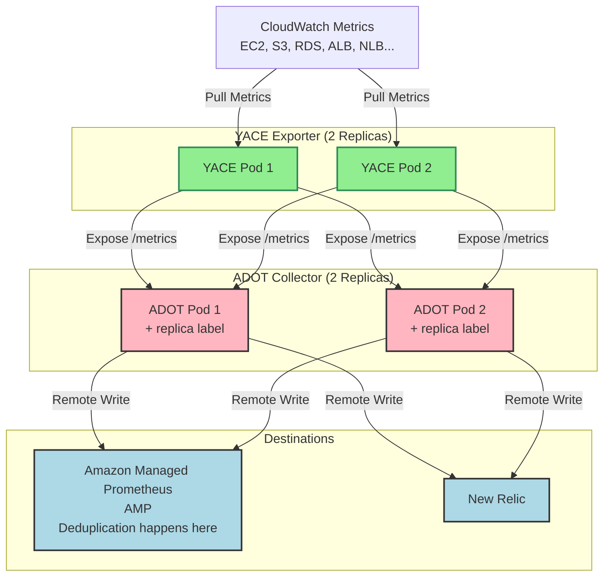

# Central OTEL Gateway - Deduplication Explained

## Overview

We are pulling **CloudWatch metrics** through Yet Another CloudWatch Exporter (YACE) and sending it to AMP/New Relic via ADOT collector

**Goal**: High Availability (HA) + Minimal Duplication

---

## Flow

1. CloudWatch emits metrics
2. 2 Pods of YACE pull metrics from CloudWatch --> Duplication possible
3. ADOT (2 replicas) scrapes metrics from YACE Pods. Every ADOT pod has replica label added with the metric name.
4. Metrics flow into both AMP and New Relic
5. Duplications are managed automatically at AMP - replica label + timestamp basis

# IMPORTANT:
1. YACE has two replicas for HA, in case one pod gets down, other will still serve the ttaffic
2. AMP manages any kind of duplication automatically.

## Architecture

